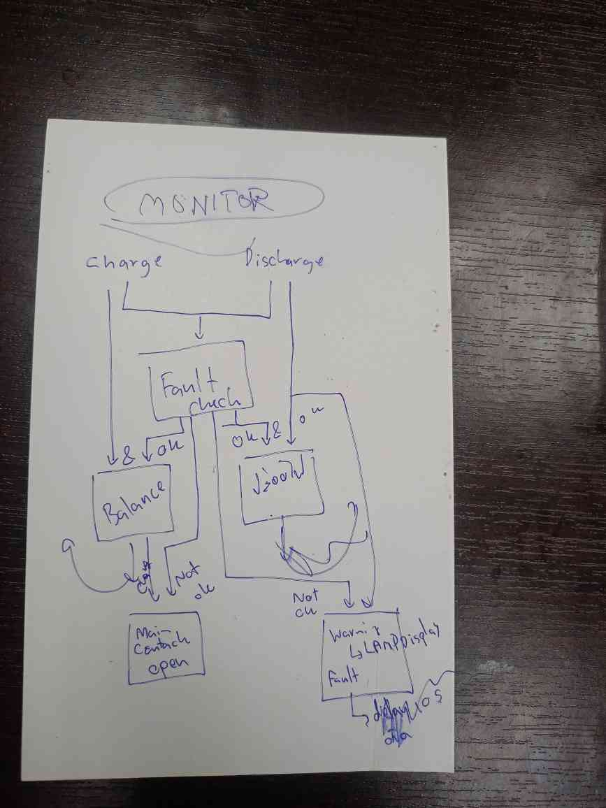

# BMS Project
Build by KMUTT BlackPearlRacingteam for BP16 FSAE 2025 competition and onward

## Architecture

```
BMU1-7 (ESP32-C3)          BCU (ESP32-S3)              Datalogger (ESP32-S3)
  │                           │                            │
  ├─ LTC6811 (SPI)           ├─ CAN RX ← BMU1-7           ├─ WiFi WebSocket
  │  └─ 10 cells/module      ├─ Local LTC6811 (Module 8)  ├─ RTC timestamp
  ├─ NTC thermistors (x2)    ├─ Aggregation (500ms)       └─ SD card logging
  └─ CAN TX (1000ms)         ├─ AMS_OK output (GPIO2)
     └─ 5 messages/module    └─ OBC charger control
```

## Project Structure

```
├── src/
│   ├── bmu.cpp       # Battery Monitoring Unit (slave)
│   ├── bcu.cpp       # Battery Control Unit (master)
│   ├── datalog.cpp   # SD logging + WiFi streaming
│   ├── helper.cpp    # CAN ID encoding, byte utils
│   └── ntstermistor.cpp  # NTC temperature conversion
│
├── include/
│   ├── ams_common_conf.h  # Cell specs, CAN timing, structs
│   ├── helper.h
│   └── ntstermistor.h
│
└── lib/
    ├── LTC6811/      # Cell voltage IC driver
    ├── LTC681x/      # Multi-cell register control
    ├── LT_SPI/       # SPI for LTC chips
    ├── Linduino/     # Arduino compatibility layer
    ├── CAN32_util/   # ESP32 TWAI wrapper
    ├── SD32_util/    # SD card persistent logging
    ├── BP_mobile_util/   # WebSocket client
    ├── WIFI32_util/  # WiFi management
    ├── RTClib_helper/    # DS3231 RTC
    └── syncTime_util/    # Time sync (RTC/NTP/WS)
```

## BMU (Battery Monitoring Unit)

Runs on ESP32-C3. Each module monitors 10 cells.

**Functions:**
- Read cell voltages via LTC6811 (SPI)
- Read temperature via NTC thermistors (2 per module)
- Detect faults: overvoltage, undervoltage, overtemp, cell imbalance
- Passive cell balancing during charge

**CAN TX (every 1000ms):**
- MSG1: Operation status, balancing bitmap, temps
- MSG2: Cell 1-8 voltages (0.02V scale)
- MSG3: Cell 9-10 voltages

**CAN TX (every 1300ms):**
- MSG4: OV/LV warning & critical flags
- MSG5: Temp/DV warning & critical flags

**Hardware:**
- SPI: CS=7, SCK=4, MISO=5, MOSI=6
- ADC: Temp1=0, Temp2=1
- CAN: TX=20, RX=21

Reference: [Linduino LTsketchbook](https://github.com/analogdevicesinc/Linduino)

## BCU (Battery Control Unit)

Runs on ESP32-S3. Master aggregator for all modules.

**Functions:**
- Receive CAN data from 7 BMU slaves
- Monitor local cells (Module 8) via onboard LTC6811
- Track BMU connection status (1500ms timeout)
- Aggregate pack data every 500ms
- Determine AMS_OK status (any critical fault → LOW)
- Broadcast config to BMUs, control OBC charger

**Hardware:**
- CAN: TX=48, RX=47
- AMS_OK output: GPIO2 (active high)
- Charger detect: GPIO9

## Datalogger

Runs on ESP32-S3. Logs all BMS data to SD card + streams via WiFi.

**Functions:**
- SD card: CSV per module + AMS summary, session directories
- RTC: Unix timestamps via DS3231
- WiFi: WebSocket to BP Mobile server (JSON payload)

**Hardware:**
- SD: CS=10, MOSI=11, MISO=13, SCK=12
- I2C: RTC DS3231

## Configuration

Key values in `include/ams_common_conf.h`:

| Parameter | Value | Description |
|-----------|-------|-------------|
| CELL_NUM | 10 | Cells per module |
| MODULE_NUM | 8 | Total modules (1 BCU + 7 BMU) |
| VMAX_CELL | 4.2V | LG34 Li-ion max |
| VMIN_CELL | 3.2V | LG34 Li-ion min |
| DVMAX | 0.2V | Max cell imbalance |
| TEMP_MAX_CELL | 60°C | Temperature limit |
| BMS_COMMUNICATE_TIME | 1000ms | BMU TX interval |
| DISCONNENCTION_TIMEOUT | 1500ms | BMU loss detection |
| CAN Bitrate | 250 kbps | Standard vehicle CAN |

## CAN Protocol

**Extended CAN ID Format:** `0x18PMRRMM`
- P: Priority (1=fault, 2=data)
- RR: Source address (Module 1-8)
- MM: Message number

**BCU Broadcast:** `0x18000000`
- Byte 0-1: Transmission time
- Byte 2: Charger plugged
- Byte 3-6: Vmax, Vmin, TempMax, dVmax
- Byte 7: Update flag

## How to Use

1. Install PlatformIO (terminal or VSCode extension)
2. Clone this repo
3. Select build environment:
   ```
   pio run -e bmu      # Battery Monitoring Unit
   pio run -e bcu      # Battery Control Unit
   pio run -e datalog  # Datalogger
   ```
4. Upload and monitor:
   ```
   pio run -e <env> -t upload && pio device monitor
   ```

## Communication Docs

[Checkout the spreadsheet for BMS ↔ subsystem integration:](https://docs.google.com/spreadsheets/d/1TbN9bK0u2_f_2LeJMQZu6MZCuvkwzeiOJ2B9JoZcbQw/edit?gid=226357247#gid=226357247)

